> [尚硅谷React](https://www.bilibili.com/video/BV1wy4y1D7JT?p=43&t=5)

# 1. React简介

>React官网：[https://react.docschina.org/docs/add-react-to-a-website.html](https://react.docschina.org/docs/add-react-to-a-website.html)

**react是什么？**

React用于构建用户**界面**的JS库。**是一个将数据渲染为HTML视图的开源JS库。**

**谁开发的？**

Facebook开发开源

**为什么学？**

1.原生JS操作DOM繁琐，效率低（DOM Api操作ui）

2.使用JS直接操作DOM,浏览器会进行大量的**重绘重排**

3.原生JS没有**组件化**编码方案，代码复用低

**库与框架的区别？**

> 在学习之前最好看一下关于npm的知识：[npm](https://blog.csdn.net/qq_25502269/article/details/79346545)


# 2. React入门

## React 基础案例

1.先导入三个包：

【先引入react.development.js，后引入react-dom.development.js】

``` js
react.development.js
react-dom.development.js
babel.min.js 
```

2.创建一个容器

3.创建虚拟DOM，渲染到容器中

``` html
<body>
    <!-- 准备好容器 -->
    <div id="test">

    </div>
</body>
<!-- 引入依赖 ,引入的时候，必须就按照这个步骤-->
<script src="../js/react.development.js" type="text/javascript"></script>
<script src="../js/react-dom.development.js" type="text/javascript"></script>

<script src="../js/babel.min.js" type="text/javascript"></script>

<!--这里使用了babel用来解析jsx语法-->
<script type="text/babel">
        // 1.创建虚拟DOM
        const VDOM = <h1>Hello</h1>  //这个地方使用的是JSX语法，不需要加""
        // 2.渲染，如果有多个渲染同一个容器，后面的会将前面的覆盖掉
        ReactDOM.render(VDOM,document.getElementById("test"));        
</script>
</html>
```

这样，就会在页面中的这个div容器上添加这个h1.

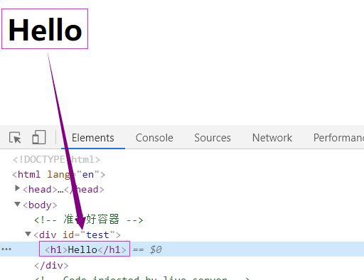

## JSX基础语法

1.定义虚拟DOM，不能使用“”

2.标签中混入JS**表达式**的时候使用**{}**

3.样式的类名指定不要使用class，使用className

4.内敛样式要使用双大括号{{}}包裹

5.不能有多个根标签，只能有一个跟标签

6.标签必须闭合

7.如果小写字母开头，就将标签转化为html同名元素，如果html中无该标签对应的元素，就报错；如果是大写字母开头，react就去渲染对应的组件，如果没有就报错

> 关于JS表达式和JS语句：
>
>   **JS表达式**：返回一个值，可以放在任何一个需要值的地方  a  a+b  demo(a)  arr.map() function text(){}
>   **JS语句**：if(){} for(){} while(){} swith(){} 不会返回一个值

> 一定注意区分：【js语句(代码)】与【js表达式】
>
> ​     *1.**表达式**：一个表达式会产生一个值，可以放在任何一个需要值的地方*
>
> ​        *下面这些都是表达式：*
>
> ​          *(1). a*
>
> ​          *(2). a+b*
>
> ​          *(3). demo(1)*
>
> ​          *(4). arr.map()* 
>
> ​          *(5). function test () {}*
>
> ​     *2.**语句(代码)**：*
>
> ​        *下面这些都是语句(代码)：*
>
> ​          *(1).if(){}*
>
> ​          *(2).for(){}*
>
> ​          *(3).switch(){case:xxxx}*

  

实例如下：

```html
<!DOCTYPE html>
<html lang="en">
<head>
    <meta charset="UTF-8">
    <meta name="viewport" content="width=device-width, initial-scale=1.0">
    <title>Document</title>
    <style>
        .sss{
            color: red;
        }
    </style>
</head>
<body>
    <!-- 准备好容器 -->
    <div id="test">
        
    </div>
</body>
<!-- 引入依赖 ,引入的时候，必须就按照这个步骤-->
<script src="../js/react.development.js" type="text/javascript"></script>
<script src="../js/react-dom.development.js" type="text/javascript"></script>

<script src="../js/babel.min.js"></script>
<!--这里使用了js来创建虚拟DOM-->
<script type="text/babel">
        const MyId = "title";
        const MyData = "Cyk";
        // 1.创建虚拟DOM
        const VDOM = (
            <h1 id = {MyId.toLocaleUpperCase()}>
                <span className = "sss" style = {{fontSize:'50px'}}>sss</span>
            </h1>
        )
        // 2.渲染，如果有多个渲染同一个容器，后面的会将前面的覆盖掉
        ReactDOM.render(VDOM,document.getElementById("test"));
</script>

</html>
```

## 两种创建虚拟DOM的方式

**1.使用JSX创建虚拟DOM**

```jsx
 const VDOM = (
            <h1 id = {MyId.toLocaleUpperCase()}>
                <span className = "sss" style = {{fontSize:'50px'}}>sss</span>
            </h1>
        )
```

这个在上面的案例中已经演示过了 ，下面看看另外一种创建虚拟DOM的方式

**2.使用JS创建虚拟DOM**

```js
// 1.创建虚拟DOM[在这使用了js的语法]React.createElement(标签,标签属性,内容)
const VDOM = React.createElement('h1',{id:"title"},"nihao")
```

使用JS和JSX都可以创建虚拟DOM，但是可以看出JS创建虚拟DOM比较繁琐，尤其是标签如果很多的情况下，所以还是比较推荐使用JSX来创建。

**3.关于虚拟DOM：**

​     *1.本质是Object类型的对象（一般对象）*

​     *2.虚拟DOM比较“轻”，真实DOM比较“重”，因为虚拟DOM是React内部在用，无需真实DOM上那么多的属性。*

​     *3.虚拟DOM最终会被React转化为真实DOM，呈现在页面上。*


# 3. React组件

当应用是以多组件的方式实现，这个应用就是一个组件化的应用

> **注意：** 组件名称必须以大写字母开头。
>
> React 会将以小写字母开头的组件视为原生 DOM 标签。例如，< div />` 代表 HTML 的 div 标签，而 `< Weclome /> 则代表一个组件，并且需在作用域内使用 `Welcome`
>
> 传递的参数，不能在组件中改动

## 函数式组件

```react
//1.先创建函数，函数可以有参数，也可以没有，但是必须要有返回值 返回一个虚拟DOM
function Welcome(props) {
  return <h1>Hello, {props.name}</h1>;
}
//2.进行渲染
ReactDOM.Render(<Welcom name = "ss" />,document.getElementById("div"));
```


让我们来回顾一下这个例子中发生了什么：

1. 我们调用 `ReactDOM.render()` 函数，并传入 ` <Welcome name="Sara" /> ` 作为参数。
2. React 调用 `Welcome` 组件，并将 `{name: 'Sara'}` 作为 props 传入。
3. `Welcome` 组件将 `Hello, Sara` 元素作为返回值。
4. React DOM 将 DOM 高效地更新为 `Hello, Sara`。

> 注意
>
> 组件函数中的this是undefined，因为babel编译后开启了**严格模式**: 禁止函数里的this指向window


## Class组件

补充 Class基础

```javascript
<script type="text/javascript" >
		//创建一个Person类
		class Person {
			//构造器方法
			constructor(name,age){
				//构造器中的this是谁？—— 类的实例对象
				this.name = name
				this.age = age
			}
			//一般方法
			speak(){
				// 重点一：speak方法放在了哪里？——类的原型对象上，供实例使用
				// 重点二：speak中的this是谁？通过Person实例调用speak时，speak中的this就是Person实例
				console.log(`我叫${this.name}，我年龄是${this.age}`);
			}
		}
		const p1 = new Person('p1', 19);
		const p2 = new Person('p2', 29);
		p1.speak()	// this指向改变
		p2.speak.call({a:1,b:2})	// this指向改变

		//创建一个Student类，继承于Person类
		class Student extends Person {
			constructor(name,age,grade){
				super(name,age)	// 必须调用super, 且在最开始调用
				this.grade = grade
				this.school = '尚硅谷'
			}
			//重写从父类继承过来的方法
			speak(){
				console.log(`我叫${this.name}，我年龄是${this.age},我读的是${this.grade}年级`);
				this.study()
			}
			study(){
				// study方法放在了哪里？——类的原型对象上，供实例使用
				// 通过Student实例调用study时，study中的this就是Student实例
				console.log('我很努力的学习');
			}
		}
		const s1 = new Student('校长', 15, '高一');
		s1.speak()

		class Car {
			constructor(name,price){
				this.name = name
				this.price = price
				// this.wheel = 4
			}
			//类中可以直接写赋值语句,如下代码的含义是：给Car的实例对象添加一个属性，名为a，值为1
			a = 1
			wheel = 4
			static demo = 100
		}
		const c1 = new Car('奔驰c63',199)
		console.log(c1);
		console.log(Car.demo);
	</script>
```

> 总结：
> 1.类中的构造器不是必须要写的，要对实例进行一些初始化的操作，如添加指定属性时才写。
> 2.如果A类继承了B类，且A类中写了构造器，那么A类构造器中的super是必须要调用的。
> 3.类中所定义的方法，都放在了类的原型对象上，供实例去使用。


**实例**：

```react
// 1.必须继承React.Component
// 2.然后重写Render()方法，该方法一定要有返回值，返回一个虚拟DOM
class Welcome extends React.Component {
  render() {
    //render是放在哪里的？—— MyComponent的原型对象上，供实例使用。
	//render中的this是谁？—— MyComponent的实例对象 <=> MyComponent组件实例对象。		
    return <h1>Hello, {this.props.name}</h1>;
  }
}
//渲染 【这个跟之前也是一样的】
ReactDOM.Render(<Welcom name = "ss" />,document.getElementById("div"));
```

**注意**：

1.render是放在哪里的？—— MyComponent的原型对象上，供实例使用。
2.render中的this是谁？—— **MyComponent的实例对象** <=> MyComponent组件实例对象。

**执行过程**：

​    1.React解析组件标签，找到相应的组件

​    2.发现组件是类定义的，**随后new出来的类的实例，并通过该实例调用到原型上的render方法**

​    3.将render返回的虚拟DOM转化为真实的DOM,随后呈现在页面中


## 组件案例

下面，我们通过一个案例更好的理解组件：【只关注与核心代码】

我们发现组件是可以包含中使用的， 而且如果创建的数组，必须要代一个key。数组元素中使用的 key 在其兄弟节点之间应该是独一无二的。然而，它们不需要是全局唯一的。当我们生成两个不同的数组时，我们可以使用相同的 key 值 

```react
<script type="text/babel">

        //创建一个组件<li>
        function GetLi(props){      
            return <li>{props.value}</li>
        };

        // 1.创建类式组件<ul>
        class MyComponent extends React.Component{
            render(){
                console.log(this.props.arr);
                let com = this.props.arr.map((item,index)=>
                     //在这个地方包含了GetLi这个组件，【注意不能用{}】
                     //因为这个是一个列表，所以必须传递一个key【独一无二的Key】
                     //key 帮助 React 识别哪些元素改变了，比如被添加或删除。
                        <GetLi value={item} key = {index} />
                    );
                console.log(com);
                return <ul>{com}</ul>
            }
        }
        
        let num = [1,2,3,4]
        //2.渲染组件
        ReactDOM.render(<MyComponent  arr={num}/>,document.getElementById("test");
</script>

```


## 类组件的实例的三大属性

### state

> 复习——this指向问题
>
> [尚硅谷教程p12-p16](https://www.bilibili.com/video/BV1wy4y1D7JT?p=12&spm_id_from=pageDriver)

|  人  | 状态 | 影响 | 行为 |
| :--: | :--: | :--: | :--: |
| 组件 | 状态 | 驱动 | 页面 |

我们都说React是一个状态机，体现是什么地方呢，就是体现在state上，通过与用户的交互，实现不同的状态，然后去渲染UI,这样就让用户的数据和界面保持一致了。**state是组件的私有属性**。

在React中，更新组件的state，结果就会重新渲染用户界面(不需要操作DOM),一句话就是说，**用户的界面会随着状态的改变而改变**。

state是组件对象最重要的属性，值是对象（可以包含多个key-value的组合）

**案例**：

1.需求：页面显示【今天天气很炎热】，鼠标点击文字的时候，页面更改为【今天天气很凉爽】

核心代码如下：

```react

<!--这里使用了js来创建虚拟DOM-->
<script type="text/babel">
        //1.创建组件
        class St extends React.Component{
            constructor(props){
                super(props);
                //先给state赋值
                this.state = {isHot:true,win:"ss"};
                //找到原型的dem，根据dem函数创建了一个dem1的函数，并且将实例对象的this赋值过去
                this.dem1 = this.dem.bind(this);
            }
            //render会调用1+n次【1就是初始化的时候调用的，n就是每一次修改state的时候调用的】
            render(){ //这个This也是实例对象
                //如果加dem()，就是将函数的回调值放入这个地方
                //this.dem这里面加入this，并不是调用，只不过是找到了dem这个函数，在调用的时候相当于直接调用，并不是实例对象的调用
                return <h1 onClick = {this.dem1}>今天天气很{this.state.isHot?"炎热":"凉爽"}</h1>    
            }
            //通过state的实例调用dem的时候，this就是实例对象
            dem(){
                const state =  this.state.isHot;
                 //状态中的属性不能直接进行更改，需要借助API
                // this.state.isHot = !isHot; 错误
                //必须使用setState对其进行修改，并且这是一个合并
                this.setState({isHot:!state});
            }
        }
        // 2.渲染，如果有多个渲染同一个容器，后面的会将前面的覆盖掉
        ReactDOM.render(<St />,document.getElementById("test"));
</script>
```

**注意**：

1.组件的构造函数，必须要传递一个props参数

2.特别关注this【重点】，类中所有的方法局部都开启了严格模式，如果直接进行调用，this就是undefined

3.想要改变state,需要使用**setState**进行修改，如果只是修改state的部分属性，则不会影响其他的属性，这个只是**合并**并不是覆盖。


#### **this.setState()**

该方法接收两种参数：对象或函数。

1. 对象：即想要修改的state
2. 函数：接收两个函数，第一个函数接受两个参数，第一个是当前state，第二个是当前props，该函数返回一个对象，和直接传递对象参数是一样的，就是要修改的state；第二个函数参数是state改变后触发的回调

在此还需要注意的是，setState有异步更新和同步更新两种形式，那么什么时候会同步更新，什么时候会异步更新呢？

- **React控制之外的事件中调用setState是同步更新的。比如原生js绑定的事件，	setTimeout/setInterval等**。

- **大部分开发中用到的都是React封装的事件，比如onChange、onClick、	onTouchMove等，这些事件处理程序中的setState都是异步处理的。**

```react
//1.创建组件
class St extends React.Component{
    //可以直接对其进行赋值
    state = {isHot:10};
    render(){ //这个This也是实例对象
        return <h1 onClick = {this.dem}>点击事件</h1> 
    }
//箭头函数 [自定义方法--->要用赋值语句的形式+箭头函数]
    dem = () =>{
        //修改isHot
        this.setState({ isHot: this.state.isHot + 1})
        console.log(this.state.isHot);
    }
}
```

上面的案例中预期setState使得isHot变成了11，输出也应该是11。然而在控制台打印的却是10，也就是并没有对其进行更新。这是因为异步的进行了处理，在输出的时候还没有对其进行处理。

```react
componentDidMount(){
    document.getElementById("test").addEventListener("click",()=>{
        this.setState({isHot: this.state.isHot + 1});
        console.log(this.state.isHot);
    })
}
```

但是通过这个原生JS的，可以发现，控制台打印的就是11，也就是已经对其进行了处理。也就是进行了同步的更新。

#### **React怎么调用同步或者异步的呢？**

- 在 React 的 setState 函数实现中，会根据一个变量 isBatchingUpdates 判断是直接更新 this.state 还是放到队列中延时更新，而 isBatchingUpdates 默认是 false，表示 setState 会同步更新 this.state；但是，有一个函数 batchedUpdates，该函数会把 isBatchingUpdates 修改为 true，而当 React 在调用事件处理函数之前就会先调用这个 batchedUpdates将isBatchingUpdates修改为true，这样由 React 控制的事件处理过程 setState 不会同步更新 this.state。

- **如果是同步更新，每一个setState对调用一个render，并且如果多次调用setState会以最后调用的为准，前面的将会作废；如果是异步更新，多个setSate会统一调用一次render**

```react
dem = () =>{
    this.setState({
        isHot:  1,
        cont:444
    })
    this.setState({
    	isHot: this.state.isHot + 1

    })
    this.setState({
        isHot:  888,
        cont:888
    })
}
```

上面的最后会输出：isHot是888，cont是888

```react
 dem = () =>{
                
                this.setState({
                    isHot: this.state.isHot + 1,
                    
                })
                this.setState({
                    isHot: this.state.isHot + 1,
                    
                })
                this.setState({
                    isHot: this.state.isHot + 888
                })
            }
```

初始isHot为10，最后isHot输出为898，也就是前面两个都没有执行。

**注意！！这是异步更新才有的，如果同步更新，每一次都会调用render，这样每一次更新都会 **

**简化版本：**

1.state的赋值可以不再构造函数中进行

2.使用了箭头函数，将this进行了改变

```react
<script type="text/babel">
        class St extends React.Component{
            //可以直接对其进行赋值
            state = {isHot:true};
            render(){ //这个This也是实例对象
                return <h1 onClick = {this.dem}>今天天气很{this.state.isHot?"炎热":"凉爽"}</h1>    
                //或者使用{()=>this.dem()也是可以的}
            }
            //箭头函数 [自定义方法--->要用赋值语句的形式+箭头函数]
            dem = () =>{
                console.log(this);
                const state =  this.state.isHot;
                this.setState({isHot:!state});
            }
        }
        ReactDOM.render(<St />,document.getElementById("test"));       
</script>
```

如果想要在调用方法的时候传递参数，有两个方法：

```react
<button onClick={(e) => this.deleteRow(id, e)}>Delete Row</button>
<button onClick={this.deleteRow.bind(this, id)}>Delete Row</button>
```

上述两种方式是等价的，分别通过[箭头函数](https://developer.mozilla.org/en-US/docs/Web/JavaScript/Reference/Functions/Arrow_functions)和 [`Function.prototype.bind`](https://developer.mozilla.org/en-US/docs/Web/JavaScript/Reference/Global_objects/Function/bind) 来实现。

在这两种情况下，React 的事件对象 `e` 会被作为第二个参数传递。如果通过箭头函数的方式，事件对象必须显式的进行传递，而通过 `bind` 的方式，事件对象以及更多的参数将会被隐式的进行传递。


### Props

作用：Props主要用来传递数据，比如组件之间进行传值

##### 基本使用：

```react
<body>
    <div id = "div">

    </div>

</body>
<script type="text/babel">
    class Person extends React.Component{
        render(){
            return (
                <ul>
                    //接受数据并显示
                    <li>{this.props.name}</li>
                    <li>{this.props.age}</li>
                    <li>{this.props.sex}</li>
                </ul>
            )
        }
    }
    //传递数据
    ReactDOM.render(<Person name="tom" age = "41" sex="男"/>,document.getElementById("div"));
</script>
```

如果传递的数据是一个对象，可以更加简便的使用

```react
<script type="text/babel">
    class Person extends React.Component{
        render(){
            return (
                <ul>
                    <li>{this.props.name}</li>
                    <li>{this.props.age}</li>
                    <li>{this.props.sex}</li>
                </ul>
            )
        }
    }
    const p = {name:"张三",age:"18",sex:"女"}
   ReactDOM.render(<Person {...p}/>,document.getElementById("div"));
</script>
```

`... `这个符号恐怕都不陌生，这个是一个展开运算符，主要用来展开数组，如下面这个例子：

```js
arr = [1,2,3];
arr1 = [4,5,6];
arr2 = [...arr,...arr1];  //arr2 = [1,2,,3,4,5,6]
```

但是他还有其他的用法：

1.复制一个对象给另一个对象{...对象名}。此时这两个对象并没有什么联系了

```js
const p1 = {name:"张三",age:"18",sex:"女"}
const p2 = {...p1};	// 复制
p1.name = "sss";
console.log(p2)  //{name:"张三",age:"18",sex:"女"}
```

2.在复制的时候，合并其中的属性

```js
 const p1 = {name:"张三",age:"18",sex:"女"}
 const p2 = {...p1,name : "111",hua:"ss"};
 p1.name = "sss";
 console.log(p2)  //{name: "111", age: "18", sex: "女",hua:"ss"}
```

**注意！！** **{...P}并不能展开一个对象**

**props传递一个对象，是因为babel+react使得{..p}可以展开对象，但是只有在标签中才能使用**


##### **对于props限制**

很多时候都想要传递的参数进行相应的限制，比如：限制传递参数的类型，参数的默认值等等

react对此提供了相应的解决方法：

- propTypes:类型检查，还可以限制不能为空
- defaultProps：默认值

```react
<script type="text/babel">

    
    class Person extends React.Component{
        render(){
            //props是只读的
            return (
                <ul>
                    <li>{this.props.name}</li>
                    <li>{this.props.age}</li>
                    <li>{this.props.sex}</li>
                </ul>
            )
        }
        //对组件的属性对其进行限制
        static propTypes = {
            name:PropTypes.string.isRequired, //限定name是string类型，并且必须要传递
            sex:PropTypes.string,  //限定sex是string类型
            speak:PropTypes.func   //限定speak是function类型
        }
        //指定默认的标签属性
        static defaultProps = {
            sex:"不男不女",
            age:18
        }   
        
    }
    //在js中可以使用{...p}来复制一个对象，但是这个地方并不是复制对象，而是babel+react通过展开运算符，展开了一个对象
    //但是只能在标签中进行使用
    //const p = {name:"张三",age:"18",sex:"女"}   {14}就代表的是数值
    //ReactDOM.render(<Person {...p}/>,document.getElementById("div"));
    ReactDOM.render(<Person name="sss" age = {14} speak="8"/>,document.getElementById("div"));
    

    function speak(){
        console.log("这个是一个函数")
    }

</script>
</html>

```

##### **函数式组件的使用**

函数在使用props的时候，是作为参数进行使用的(props)；

```react
function Person(props){
          return (
                <ul>
                    <li>{props.name}</li>
                    <li>{props.age}</li>
                    <li>{props.sex}</li>
                </ul>
            )
    }
```


### Refs

 作用：Refs 提供了一种方式，允许我们访问 DOM 节点或在 render 方法中创建的 React 元素。 

Refs主要提供了三种方式：

##### **1.字符串形式**

在想要获取到一个DOM节点，可以直接在这个节点上添加ref属性。利用该属性进行获取该节点的值。

案例：给需要的节点添加ref属性，此时该实例对象的refs上就会有这个值。就可以利用实例对象的refs获取已经添加节点的值

```react
<input ref="dian" type="text" placeholder="点击弹出" />

 inputBlur = () =>{
            alert(this.refs.shiqu.value);
        }
```


##### **2.回调形式**

回调形式会在ref属性中添加一个回调函数。**将该DOM作为参数传递过去。**

如：ref里面就是一个回调函数，self就是该input标签。然后在将该DOM元素赋值给实例对象中的一个属性

```react
<input ref={self =>{ this.dian = self;console.log(self)}}  placeholder="点击弹出" />
```

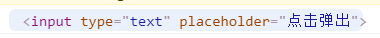

也可以将函数提取出来，在ref中进行调用

```react
isRef = (self) =>{
            this.dian = self;
            console.log(self)
        }

<input ref={this.isRef} type="text" placeholder="点击弹出" />
```

>关于Refs中的回调次数问题
>
>如果 `ref` 回调函数是以内联函数的方式定义的，在更新过程中它会被执行两次，第一次传入参数 `null`，然后第二次会传入参数 DOM 元素。这是因为在每次渲染时会创建一个新的函数实例，所以 React 清空旧的 ref 并且设置新的。通过将 ref 的回调函数定义成 class 的绑定函数的方式可以避免上述问题，但是大多数情况下它是无关紧要的。


##### **3.API形式**

React其实已经给我们提供了一个相应的API，他会自动的将该DOM元素放入实例对象中

如下：依旧先在DOM元素中添加一个ref元素

```react
{/*<input ref={this.容器名称} type="text" placeholder="点击弹出" />*/}
<input ref={this.MyRef} type="text" placeholder="点击弹出" />
<input ref={this.MyRef1} type="text" placeholder="点击弹出" />
```

通过API，创建React的容器，相当于省略了回调的中间环节。但是这个容器是专门专用的，所以每一个ref都需要创建这个。该API会将DOM元素赋值给实例对象的名称为容器名称的属性的current【这个current是固定的】

```react
{/*容器名称 = React.createRef()*/}
MyRef = React.createRef();
MyRef1 = React.createRef();
```

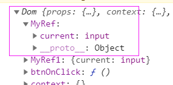

然后就可以使用了

```react
btnOnClick = () =>{
    //创建之后，将自身节点，传入current中
    console.log(this.MyRef.current.value);
}
```

**官方提示我们不要过度的使用ref，如果发生时间的元素刚好是需要操作的元素，就可以使用事件去替代。**


# 4. React事件

##### 一般事件

React的事件是通过**onXxx**属性指定事件处理函数

- React使用的都是自定义的事件，而不是原生的事件 *—————— 为了更好的兼容性*

- React中的事件是通过事件委托方式处理的(委托给组件最外层的元素) *——————为了的高效*

- **事件中必须返回的是函数**

- 通过event.target得到发生事件的Dom元素对象 *——————不要过度使用ref*

比如：

先声明一个事件，然后在根据事件创建相应的函数，根据事件的event参数，将DOM元素获取到。

```react
<input onChange={this.saveName} type = "text" name ="username"/>

saveName = (event) =>{
            this.setState({name:event.target.value});
        }
```


##### **受控和非受控组件**

先来说说受控组件：

 使 React 的 state 成为“**唯一数据源**”。渲染表单的 React 组件还控制着用户输入过程中表单发生的操作。被 React 以这种方式控制取值的表单输入元素就叫做“受控组件”。 

```react
saveName = (event) =>{
    this.setState({name:event.target.value});
}

savePwd = (event) => {
    this.setState({pwd:event.target.value});
}

render() {
    return (
        <form action="http://www.baidu.com" onSubmit={this.login}>
            用户名：<input value={this.state.name} onChange={this.saveName} type = "text" />
            密码<input value={this.state.pwd} onChange={this.savePwd} type = "password"/>
            <button>登录</button>
        </form>
    )
}
```

由于在表单元素上设置了 `value` 属性，因此显示的值将始终为 `this.state.value`，这使得 React 的 state 成为唯一数据源。由于 `onchange` 在每次按键时都会执行并更新 React 的 state，因此显示的值将随着用户输入而更新。

对于受控组件来说，输入的值始终由 React 的 state 驱动。

非受控组件：

**非受控组件其实就是表单元素的值不会更新state**。输入数据都是**现用现取**的。

如下：下面并没有使用state来控制属性，使用的是事件来控制表单的属性值。

```react
class Login extends React.Component{

    login = (event) =>{
        event.preventDefault(); //阻止表单提交
            console.log(this.name.value);
            console.log(this.pwd.value);
        }
        render() {
            return (
                <form action="http://www.baidu.com" onSubmit={this.login}>
                用户名：<input ref = {self => this.name =self } type = "text" name ="username"/>
                密码：<input ref = {self => this.pwd =self } type = "password" name ="password"/>
                <button>登录</button>
                </form>
            )
    }
}
```


# 5. 函數拓展

##### **高级函数**

如果一个函数符合下面2个规范中的任何一个，那该函数就是高阶函数。

​	1.若A函数，接收的参数是一个函数，那么A就可以称之为高阶函数。

​	2.若A函数，调用的返回值依然是一个函数，那么A就可以称之为高阶函数。

*常见的高阶函数有：Promise、setTimeout、arr.map()等等*


##### **函数的珂里化**

  通过函数调用继续返回函数的方式，实现多次接收参数最后统一处理的函数编码形式

```javascript
function sum(a){
     return(b)=>{
		return (c)=>{
			return a+b+c
		}
	 }
}

```


如下，我们将上面的案例简化，创建高级函数：

```react
 class Login extends React.Component{
 
        state = {name:"",pwd:""};
		
		//返回一个函数
        saveType = (type) =>{
            return (event) => {
                this.setState({[type]:event.target.value});
            }
        }

        //因为事件中必须是一个函数，所以返回的也是一个函数，这样就符合规范了
        render() {
            return (
                <form>
      				<input onChange = {this.saveType('name')} type = "text"/>
                    <button>登录</button>
                </form>
            )
        }
    }

    ReactDOM.render(<Login />,document.getElementById("div"));
```


# 6. 生命周期

```javascript
1. 初始化阶段: 由ReactDOM.render()触发---初次渲染
	1.	constructor()
	2.	componentWillMount()
	3.	render()
	4.	componentDidMount() =====> 常用
		一般在这个钩子中做一些初始化的事，例如：开启定时器、发送网络请求、订阅消息
2. 更新阶段: 由组件内部this.setSate()或父组件render触发
	1.	shouldComponentUpdate()
	2.	componentWillUpdate()
	3.	render() =====> 必须使用的一个
	4.	componentDidUpdate()
3. 卸载组件: 由ReactDOM.unmountComponentAtNode()触发
	1.	componentWillUnmount()  =====> 常用
		一般在这个钩子中做一些收尾的事，例如：关闭定时器、取消订阅消息
```

```javascript
1. 初始化阶段: 由ReactDOM.render()触发---初次渲染
	1.	constructor()
	2.	getDerivedStateFromProps 
	3.	render()
	4.	componentDidMount() =====> 常用
		一般在这个钩子中做一些初始化的事，例如：开启定时器、发送网络请求、订阅消息
2. 更新阶段: 由组件内部this.setSate()或父组件重新render触发
	1.	getDerivedStateFromProps
	2.	shouldComponentUpdate()
	3.	render()
	4.	getSnapshotBeforeUpdate
	5.	componentDidUpdate()
3. 卸载组件: 由ReactDOM.unmountComponentAtNode()触发
	1.	componentWillUnmount()  =====> 常用
		一般在这个钩子中做一些收尾的事，例如：关闭定时器、取消订阅消息
```


## （旧）

组件从创建到死亡，会经过一些特定的阶段

​      React组件中包含一系列钩子函数{生命周期回调函数}，会在特定的时刻调用

​      我们在定义组件的时候，会在特定的声明周期回调函数中，做特定的工作

如下图是旧生命周期的结构图：

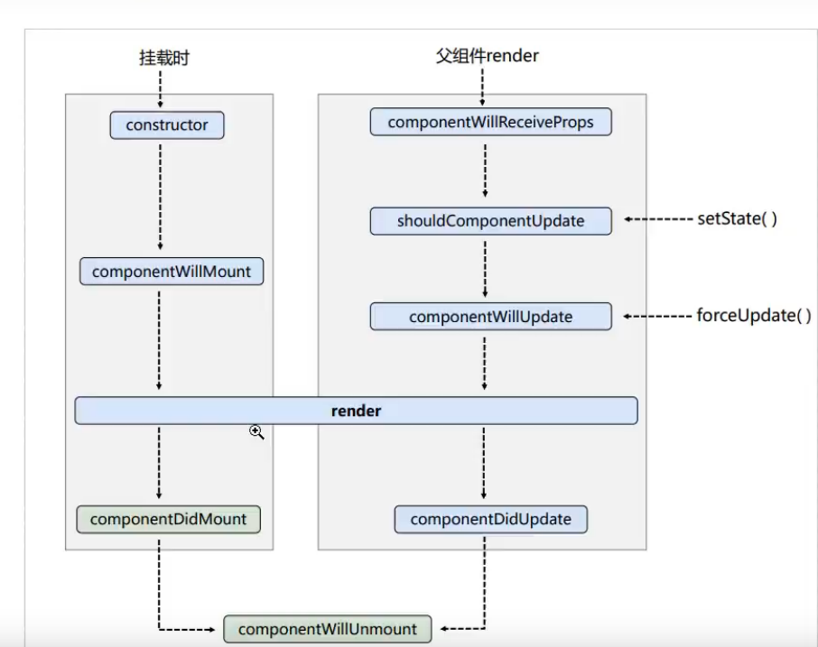

我们通过一个案例更详细的了解这个生命周期：

```react
 class A extends React.Component{

        constructor(props){
            console.log("A --- constructor")
            super(props);
            this.state = {num:1}
        }

        add = () => {
            let {num} = this.state;
            this.setState({num:num+1});
            //强制更新
            //this.forceUpdate();
        }

       render(){
           console.log("A --- render");
            return (
                <div>
                    <h1>这个是第{this.state.num}个</h1>
                    <B name = {this.state.num}/>
                    <button onClick = {this.add}>点击加一</button>
                </div>
            )
       }

       //在render之前执行
       componentWillMount(){
            console.log("A --- componentWillMount");
       }

       //在render之后执行
       componentDidMount(){
        console.log("A --- componenetDidMount");
       }

       //更新操作 setState之后执行，判断是否可以更新（true可以，false不可以）
       shouldComponentUpdate(){
            console.log("A --- shouldComponentUpdate");
            return true;
       }
       // 组件将要更新之前
       componentWillUpdate(){
            console.log("A --- componentWillUpdate");
       }
       //组件更新之后，该函数可以接受相应的参数
       componentDidUpdate(){
            console.log("A --- componentDidUpdate");
       }

       //卸载组件之后
       componentWillUnmonut(){
            console.log("A --- componentWillUnmonut");
       }
     
   }
   class B extends React.Component{
       render(){
           return(   
                <div>
                    <h1>这个是B组件,传递过来的是：{this.props.name}</h1>
                </div>
           )
       }
       //父组件进行了更新，子组件先执行这个【注意，第一次传递数据的时候，并不执行】
       componentWillReceiveProps(){
        console.log("A --- componentWillReceiveProps");
       }
   }
    ReactDOM.render(<A   />,document.getElementById("div"));
```

我们在控制台看一下：

当我们刚刚打开控制台的时候，组件第一次加载：

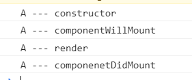

当我们点击按钮更新sate的时候：

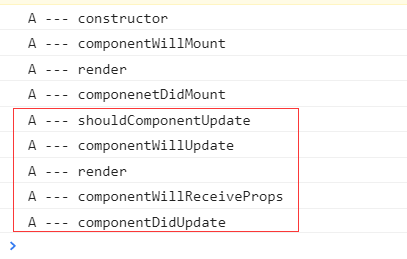

## （新）

在最新的react版本中，有些生命周期钩子被抛弃了，在官网中是这样说的：

​	我们得到最重要的经验是，过时的组件生命周期往往会带来不安全的编码实践，具体函数如下：

- `componentWillMount`
- `componentWillReceiveProps`
- `componentWillUpdate`

  这些生命周期方法经常被误解和滥用；此外，我们预计，在异步渲染中，它们潜在的误用问题可能更大。我们将在即将发布的版本中为这些生命周期添加 “UNSAFE_” 前缀。（这里的 “unsafe” 不是指安全性，而是表示使用这些生命周期的代码在 React 的未来版本中更有可能出现 **bug**，尤其是在启用异步渲染之后。）

由此可见，新版本中并不推荐持有这三个函数，取而代之的是带有UNSAFE_ 前缀的三个函数，比如: UNSAFE_ componentWillMount。即便如此，其实React官方还是不推荐大家去使用，在以后版本中有可能会去除这几个函数。

如下图是新的生命周期：

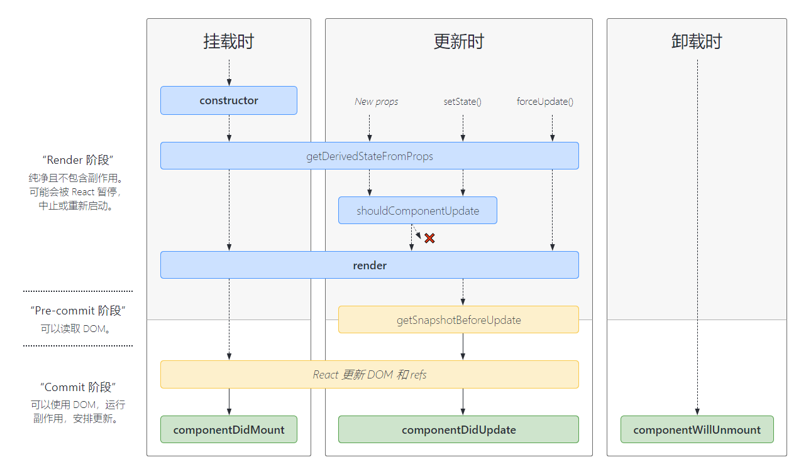

从图上可以看出，新生命周期和旧生命周期的区别主要有：

1.抛弃了上面所说的三个钩子函数【其实还可以使用】

2.新添加了两个钩子函数


现在重点说一下，新添加的钩子函数

**static getDerivedStateFromProps(props, state)**

首先，该函数会调用 **render 方法之前**调用，并且在**初始挂载**及**后续更新**时都会被调用；该函数必须是**静态**的；给组件传递的数据（props）以及组件状态（state），会作为参数到这个函数中；该函数也必须有返回值，返回一个Null或者state对象。因为初始化和后续更新都会执行这个方法，因此在这个方法返回state对象，就相当于将原来的state进行了覆盖，所以倒是修改状态不起作用。

**getSnapshotBeforeUpdate(prevProps, prevState)**

 `getSnapshotBeforeUpdate()` 在最近一次渲染输出（提交到 DOM 节点）之前调用。它使得组件能在发生更改之前从 DOM 中捕获一些信息（例如，滚动位置）。此生命周期的任何返回值将作为参数传递`componentDidUpdate()`。 

> 补充一下：componentDidUpdate(prevProps, prevState, snapshot)
>
> 该生命周期函数，可以有三个参数：原始传过来的参数，最开始的状态，getSnapshotBeforeUpdate传递的值
>
> 关于更多关于生命周期的介绍，可以参考官方文档：
>
> https://zh-hans.reactjs.org/docs/react-component.html#render

以上就是两个新添加的钩子函数，但是在现实开发中可能并不常用这两个。

**案例：在一个区域内，定时的输出以行话，如果内容大小超过了区域大小，就出现滚动条，但是内容不进行移动 **

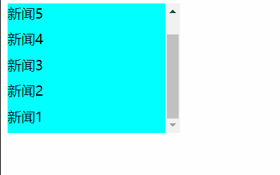

如上面的动图：区域内部的内容展现没有变化，但是可以看见滚动条在变化，也就是说上面依旧有内容在输出，只不过不在这个区域内部展现。

**实现：**

【一些css样式，就不在这展示了】

1.首先我们先实现定时输出内容

我们可以使用state状态，改变新闻后面的值，但是为了同时显示这些内容，我们应该为state的属性定义一个数组。并在创建组件之后开启一个定时器，不断的进行更新state。更新渲染组件

```react
 class New extends React.Component{

        state = {num:[]};

        //在组件创建之后,开启一个定时任务
        componentDidMount(){
            setInterval(()=>{
                let {num} = this.state;
                const news = (num.length+1);
                this.setState({num:[news,...num]});
            },2000);
        }

        render(){
            return (

                <div ref = "list" className = "list">{
                    this.state.num.map((n,index)=>{
                    return <div className="news" key={index} >新闻{n}</div>
                    })
                }</div>
            )
        }
  }
  ReactDOM.render(<New />,document.getElementById("div"));

```

2.接下来就是控制滚动条了

我们在组件渲染到DOM之前获取组件的高度，然后用组件渲染之后的高度减去之前的高度就是一条新的内容的高度，这样在不断的累加到滚动条位置上。

```react
getSnapshotBeforeUpdate(){
	return this.refs.list.scrollHeight;
}

componentDidUpdate(preProps,preState,height){
	this.refs.list.scrollTop += (this.refs.list.scrollHeight - height);
}
```

这样就实现了这个功能。

# 7. Diff算法

提到这个算法，就必须说一下关于`Key`的事情了。

其实每个组件中的每个标签都会有一个key, 只不过有的必须显示的指定，有的可以隐藏。

 如果生成的render出来后就**不会改变里面的内容，那么你不需要指定key**（不指定key时，React也会生成一个默认的标识）,或者将index作为key，只要key不重复即可。

但是如果你的标签是动态的，是有可能刷新的，就必须显示的指定key。上面案使用map进行便利的时候就必须指定Key:

```react
this.state.num.map((n,index)=>{
	return <div className="news" key={index} >新闻{n}</div>
})
```

这个地方虽然显示的指定了key，但是**官网并不推荐使用Index作为Key去使用**；

这样会很有可能会有效率上的问题

举个例子：

在一个组件中，我们先创建了两个对象，通过循环的方式放入< li>标签中，此时key使用的是index。

```react
person:[
    {id:1,name:"张三",age:18},
    {id:2,name:"李四",age:19}
]

this.state.person.map((preson,index)=>{
  return  <li key = {index}>{preson.name}</li>
})
```

如下图展现在页面中：

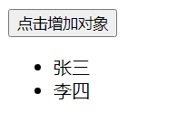

此时，我们想在点击按钮之后动态的添加一个对象，并且放入到li标签中，在重新渲染到页面中。

我们通过修改State来控制对象的添加。

```react
<button onClick={this.addObject}>点击增加对象</button>
addObject = () =>{
    let {person} = this.state;
    const p = {id:(person.length+1),name:"王五",age:20};
    this.setState({person:[p,...person]});
}
```

如下动图所示：

 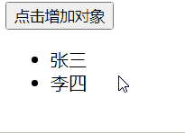 

这样看，虽然完成了功能。但是其实存在效率上的问题，	我们先来看一下两个前后组件状态的变化：

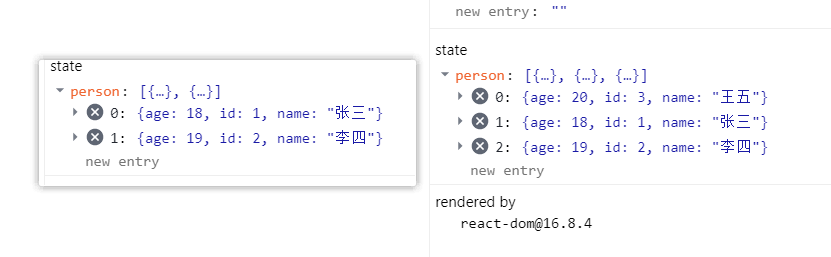

我们发现，组件第一个变成了王五，张三和李四都移下去了。因为我们使用Index作为Key，这三个标签的key也就发生了改变【张三原本的key是0，现在变成了1，李四的key原本是1，现在变成了2，王五变成了0】在组件更新状态重新渲染的时候，就出现了问题：

因为react是通过key来比较组件标签是否一致的，拿这个案例来说：

首先，状态更新导致组件标签更新，react根据Key，判断旧的虚拟DOM和新的虚拟DOM是否一致

key = 0 的时候 旧的虚拟DOM 内容是张三  新的虚拟DOM为王五 ，react认为内容改变，从而重新创建新的真实DOM.

key = 1 的时候 旧的虚拟DOM 内容是李四，新的虚拟DOM为张三，react认为内容改变，从而重新创建新的真实DOM

key = 2 的时候 旧的虚拟DOM没有，创建新的真实DOM 

这样原本有两个虚拟DOM可以复用，但都没有进行复用，完完全全的都是新创建的；这就导致效率极大的降低。

其实这是因为我们将新创建的对象放在了首位，如果放在最后其实是没有问题的，但是因为官方并不推荐使用Index作为key值，我们推荐使用id作为key值。从而完全避免这样的情况。


**虚拟DOM中key的作用：**

​     1). 简单的说: key是虚拟DOM对象的标识, 在更新显示时key起着极其重要的作用。

​     2). 详细的说: 当状态中的数据发生变化时，react会根据【新数据】生成【新的虚拟DOM】, 

​            随后React进行【新虚拟DOM】与【旧虚拟DOM】的diff比较，比较规则如下：

​         a. 旧虚拟DOM中找到了与新虚拟DOM相同的key：

​            (1).若虚拟DOM中内容没变, 直接使用之前的真实DOM

​            (2).若虚拟DOM中内容变了, 则生成新的真实DOM，随后替换掉页面中之前的真实DOM

​         b. 旧虚拟DOM中未找到与新虚拟DOM相同的key

​            根据数据创建新的真实DOM，随后渲染到到页面

**用index作为key可能会引发的问题:**

​	1.若对数据进行:逆序添加、逆序删除等破坏顺序操作:

​		会产生没有必要的真实DOM更新  界面效果没问题,但效率低。

​	2.如果结构中还包含输入类的DOM:

​        会产生错误DOM更新   界面有问题。

​	3.注意! 如果不存在对数据的逆序添加、逆序删除等破坏顺序操作，仅用于渲染列表用于展示，使用index作为key是没有问题的。

**开发如何选择key?**

​	最好使用每一条数据的唯一标识作为key 比如id，手机号，身份证号

​	如果确定只是简单的展示数据，用Index也是可以的

**而这个判断key的比较规则就是Diff算法**

Diff算法其实就是react生成的新虚拟DOM和以前的旧虚拟DOM的比较规则：

- 如果旧的虚拟DOM中找到了与新虚拟DOM相同的key:
  - 如果内容没有变化，就直接只用之前旧的真实DOM
  - 如果内容发生了变化，就生成新的真实DOM			

- 如果旧的虚拟DOM中没有找到了与新虚拟DOM相同的key:
  - 根据数据创建新的真实的DOM,随后渲染到页面上


# 8.React脚手架

react提供了一个用于创建react项目的脚手架库：create-react-app

## 创建项目并启动

1. 全局安装：`npm i -g create-react-app`

2. 创建项目：`create-react-app 项目名  `

   在这一步，有可能会出现：

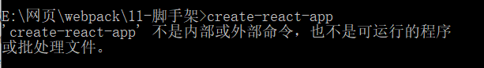

​	 这样可以直接使用：`npx create-react-app 项目名 `

3. 等待下载完成，进入项目文件夹，运行一下

   比如，我这的项目名称是hello,就先进入hello文件夹

   `cd hello`

   `npm start `  //启动这个项目

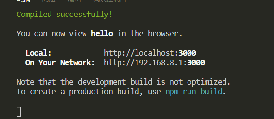

这个时会自动的打开浏览器，展现这个项目：

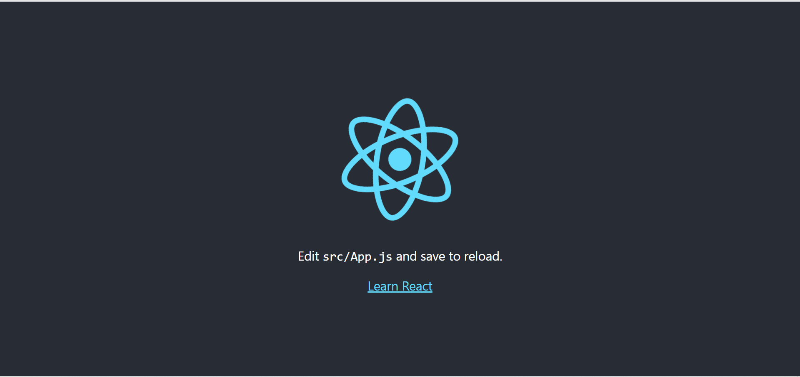


## 项目的目录结构

我们先来看一下public这个目录下面的结构：

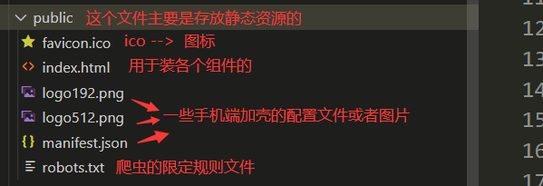

这里面最主要的还是这个Index.html文件：

```react
<!DOCTYPE html>
<html lang="en">
  <head>
    <meta charset="utf-8" />
    <!--%PUBLIC_URL%表示public文件夹的路径-->
    <link rel="icon" href="%PUBLIC_URL%/favicon.ico" />
    <!--用于开启理想视口，用于移动端页面的适配-->
    <meta name="viewport" content="width=device-width, initial-scale=1" />
    <!--用于配置浏览器地址栏的颜色（仅支持安卓手机浏览器）-->
    <meta name="theme-color" content="#000000" />
    <!--描述网页信息的-->
    <meta
      name="description"
      content="Web site created using create-react-app"
    />
    <!--用于指定网页添加到手机主屏幕后的图标（仅仅支持ios）-->
    <link rel="apple-touch-icon" href="%PUBLIC_URL%/logo192.png" />
 
    <!--应用加壳时候的配置文件 -->
    <link rel="manifest" href="%PUBLIC_URL%/manifest.json" />
  
    <title>React App</title>
  </head>
  <body>
    <!-- 浏览器不支持JS的运行的时候展现 -->
    <noscript>You need to enable JavaScript to run this app.</noscript>
    <div id="root"></div>
  </body>
</html>
```

src文件：


这里面其实最主要的就是App.js以及index.js，一个是组件，一个是将组件渲染到页面中的。


## 第一个脚手架应用

1.我们保持public中的Index.html不变

2.修改src下面的APP.js以及index.js文件

App.js:  【注意：创建好的组件一定要暴露出去】

```react
//创建外壳组件APP
import React from 'react'

class App extends React.Component{
    render(){
        return (
            <div>Hello word</div>
        )
    }
}

export default App
```

index.js: 【主要的作用其实就是将App这个组件渲染到页面上】

```react
//引入核心库
import React from 'react'
import ReactDOM from 'react-dom'
//引入组件
import App from './App'

ReactDOM.render(<App />,document.getElementById("root"))
```

这样在重新启动应用，就成功了。


我们也不建议这样直接将内容放入App组件中，尽量还是用内部组件。

我们在顶一个Hello组件：

```react
import React,{Componet} from 'react'

export default class Hello extends Componet{
    render() {
        return (
            <h1>Hello</h1>
        )
    }
}
```

在App组件中，进行使用

```react
class App extends Component{
    render(){
        return (
            <div>
                <Hello />
            </div>
        )
    }
}
```

这样的结果和前面是一样的。

但是由于普通的Js和组件都是js，所一最好组件使用jsx去展示。


## 样式冲突

当组件逐渐增多起来的时候，我们发现，组件的样式也是越来越丰富，这样就很有可能产生两个组件中样式名称有可能会冲突，这样会根据引入App这个组件的先后顺序，后面的会覆盖前面的，

为了避免这样的样式冲突，我们采用下面的形式：

1.将css文件名修改： hello.css --- >hello.module.css

2.引入并使用的时候改变方式：

```react
import React,{Component}from 'react'
import hello from './hello.module.css'  //引入的时候给一个名称

export default class Hello extends Component{
    render() {
        return (
            <h1 className={hello.title}>Hello</h1>   //通过大括号进行调用
        )
    }
}
```


# 9. 功能界面的组件化编码流程

1.拆分组件:拆分界面，抽取组件

2.实现静态组件

3.实现动态组件

- 动态的显示初始化数据
  - 数据类型
  - 数据名称
  - 保存在哪个组件
- 交互

**注意事项：**

1.拆分组件、实现静态组件。注意className、style的写法

2.动态初始化列表，如何确定将数据放在哪个组件的state中？

- 某个组件使用：放在自身的state中
- 某些组件使用：放在他们共同的父组件中【状态提升】

3.关于父子组件之间的通信

- 父组件给子组件传递数据：通过props传递
- 子组件给父组件传递数据：通过props传递，要求父组件提前给子组件传递一个函数

4.注意defaultChecked 和checked区别，defalutChecked只是在初始化的时候执行一次，checked没有这个限制，但是必须添加onChange方法类似的还有：defaultValue 和value

5.状态在哪里，操作状态的方法就在哪里


# 10. react ajax

React本身只关注与页面，并不包含发送ajax请求的代码，所以一般都是集成第三方的一些库，或者自己进行封装。

推荐使用axios。

在使用的过程中很有可能会出现跨域的问题，这样就应该配置代理。

 所谓同源（即指在同一个域）就是两个页面具有相同的协议（protocol），主机（host）和端口号（port）， 当一个请求url的**协议、域名、端口**三者之间任意一个与当前页面url不同即为跨域  。

那么react通过代理解决跨域问题呢

**方法一**

> 在package.json中追加如下配置

```json
"proxy":"请求的地址"      "proxy":"http://localhost:5000"  
```

说明：

1. 优点：配置简单，前端请求资源时可以不加任何前缀。
2. 缺点：不能配置多个代理。
3. 工作方式：上述方式配置代理，当请求了3000不存在的资源时，那么该请求会转发给5000 （优先匹配前端资源）

**方法二**

1. 第一步：创建代理配置文件

   ```
   在src下创建配置文件：src/setupProxy.js
   ```

2. 编写setupProxy.js配置具体代理规则：

   ```js
   const proxy = require('http-proxy-middleware')
   
   module.exports = function(app) {
     app.use(
       proxy('/api1', {  //api1是需要转发的请求(所有带有/api1前缀的请求都会转发给5000)
         target: 'http://localhost:5000', //配置转发目标地址(能返回数据的服务器地址)
         changeOrigin: true, //控制服务器接收到的请求头中host字段的值
         /*
         	changeOrigin设置为true时，服务器收到的请求头中的host为：localhost:5000
         	changeOrigin设置为false时，服务器收到的请求头中的host为：localhost:3000
         	changeOrigin默认值为false，但我们一般将changeOrigin值设为true
         */
         pathRewrite: {'^/api1': ''} //去除请求前缀，保证交给后台服务器的是正常请求地址(必须配置)
       }),
       proxy('/api2', { 
         target: 'http://localhost:5001',
         changeOrigin: true,
         pathRewrite: {'^/api2': ''}
       })
     )
   }
   ```

说明：

1. 优点：可以配置多个代理，可以灵活的控制请求是否走代理。
2. 缺点：配置繁琐，前端请求资源时必须加前缀。


# 11. 兄弟之间进行通信

### **消息订阅**和**发布机制**。

举个例子来说就是张三想要跟李四进行通信，张三就需要订阅一个消息【比如A消息】，李四想要给张三数据，就必须发布一个A消息，在发布的同时将数据放入消息中，因为张三订阅了名称为A的消息，此时就能接受到李四发布的消息，从而获取到数据。

这就有点类似于看报纸，甲想要知道每天都发生什么事情，于是订阅了每天日报，乙每天都会发布这个每天日报，因为甲订阅了，于是乙就会每天就给甲方推送，甲方从而获取数据。

**在消息订阅和发布中，我们可以使用PubSubJs进行通信：**

引入PubSubJs:

```react
import PubSub from 'pubsub-js'
```

订阅消息：（接收数据方）

```react
PubSub.subscribe("getSate",(_,data)=>{
            console.log(data)
        })
PubSub.subscribe("订阅的消息名称",回调函数，第一个参数是消息名称，可以使用_来占位，第二个是传递的数据
        })
```

发布消息：

```react
PubSub.publish("getSate",{isFrist:false,isLoad:true})
PubSub.publish("订阅的消息名称",传递的数据)
```


### async和await

**async:**

该关键字是放在函数之前的，使得函数成为一个异步函数，他最大的特点就是将函数回封装成Promise，也就是被他修饰的函数的返回值都是Promise对象。而这个Promise对象的状态则是由函数执行的返回值决定的。

如果返回的是一个非promise对象，该函数将返回一个成功的Promise，成功的值则是返回的值；

如果返回的是一个promise对象，则该函数返回的就是该promise对应的状态。

**await**

await右边是一个表达式，如果该表达式返回的是一个Promise对象，则左边接收的结果就是该Promise对象成功的结果，如果该Promise对象失败了，就必须使用try..catch来捕获。如果该表达式返回的是是一个不是promise对象，则左边接受的就是该表达式的返回值。

 当 [await](https://developer.mozilla.org/en-US/docs/Web/JavaScript/Reference/Operators/await) 关键字与异步函数一起使用时，它的真正优势就变得明显了 —— 事实上， **await 只在异步函数里面才起作用**。它可以放在任何异步的，基于 promise 的函数之前。它会暂停代码在该行上，直到 promise 完成，然后返回结果值。在暂停的同时，其他正在等待执行的代码就有机会执行了。 

举个例子：

```react
 f1 = () =>{
        return new Promise((resolve,reject)=>{
            // resolve(1);
            reject("错误")
        })
    }

    async function test(){
        try{
           const p =  await f1();
           console.log(p)
        }catch(error){
            console.error(error)
        }
    }
    test();
```

### fetch

以前发送请求，使用ajax或者axios，现在还可以使用fetch。这个是window自带的，和xhr是一个级别的。

可以查看这个文章，写的真的不错：

[fetch](http://www.ruanyifeng.com/blog/2020/12/fetch-tutorial.html)


# 12. React路由

## SPA

- **单页Web应用**(single page web application，SPA)。

- 整个应用只有**一个完整的页面**。

- 点击页面中的链接**不会刷新页面**，只会做页面的**局部更新**。

- 数据都需要通过**ajax**请求获取,并在前端**异步**展现


## 什么是路由

- 一个路由其实就是一个映射关系（k:v）

- key为路径，value可能是function 或者是 component

**后端路由：**

- value是function，用来处理客户端提交的请求

- 注册路由：router.get(path,function(req,res))

- 工作过程：当node接收一个请求的时候，根据请求路径找到匹配的路由，调用路由中的函数来处理请求，返回响应的数据

**前端路由：**

- 浏览器端路由，value是Component，用于展示页面内容

- 注册路由：< Route path="/test" component={Test}>

- 工作过程：当浏览器的path变为/test的时候，当前路由组件就会变成Test组件

**前端路由的原理**

- 主要是依靠于**history**，也就是浏览器的历史记录。

- 浏览器上的记录其实就是一个栈，前进一次就是**入栈**，后退一次就是**出栈**。

- 并且历史记录上有一个监听的方法，可以时时刻刻监听记录的变化。从而判断是否改变路径

[History](https://developer.mozilla.org/zh-CN/docs/Web/API/History)


## react-router-dom

react的路由有三类：

- web【主要适用于前端】

- native【主要适用于本地】

- anywhere【任何地方】

在这主要使用web也就是这个标题 react-router-dom

**基本的使用：**

导航中的a标签改写成Link标签

< Link to="/路径" >xxx< /Link>

展示区写Route标签进行路径的匹配

< Route path = '/路径' component={组件名称}>

< App>最外侧包裹了一个< BrowserRouter>或者< HashRouter>

```react
<div className="list-group">
    <Link className="list-group-item"  to="/about">About</Link>
    <Link className="list-group-item"  to="/home">Home</Link>
</div>

<div className="panel-body">
    {/* 注册路由，也就是写对应的关系 */}
    <Route path="/about"component={About}/>
    <Route path="/home"component={Home}/>
</div>

index.js:
ReactDOM.render(
    <BrowserRouter>
        <App />
    </BrowserRouter>
    ,document.getElementById("root"))
```

那么使用Link代替a标签之后，在页面上会是什么呢，我们发现其实页面上也是把link转化为了a标签

**路由组件以及一般组件**

1.写法不一样

​	一般组件：< Demo>

​	路由组件：< Route path="/demo" component ={Demo}/>

2.存放的位置一般不同

​	一般组件：components

​	路由组件：pages

3.接收的内容【props】

​	一般组件：写组件标签的时候传递什么，就能收到什么

​	路由组件：接收到三个固定的属性【history,location,match】

```js
history:
    go: ƒ go(n)
    goBack: ƒ goBack()
    goForward: ƒ goForward()
    push: ƒ push(path, state)
    replace: ƒ replace(path, state)
location:
    pathname: "/about"
    search: ""
    state: undefined

match:
    params: {}
    path: "/about"
    url: "/about"
```


**NavLink**

因为Link不能够改变标签体，因此只适合用于一些写死的标签。而如果想要有一些点击的效果，使用NavLink.

如下代码，就写了**activeClassName**，当点击的时候就会触发这个class的样式

```react
{/*NavLink在点击的时候就会去找activeClassName="ss"所指定的class的值，如果不添加默认是active
 这是因为Link相当于是把标签写死了，不能去改变什么。*/}

<NavLink  ctiveClassName="ss" className="list-group-item"  to="/about">About</NavLink>
<NavLink className="list-group-item"  to="/home">Home</NavLink> 
```

但是可能一个导航又很多标签，如果这样重复的写NavLink也会造成很多的重复性的代码问题。

因此可以自定义一个NavLink：

```react
 // 通过{...对象}的形式解析对象，相当于将对象中的属性全部展开
 //<NavLink  to = {this.props.to} children = {this.props.children}/>
<NavLink className="list-group-item" {...this.props}/>
```

​	在使用的时候：直接写每个标签中不一样的部分就行，比如路径和名称

```react
将NavLink进行封装，成为MyNavLink,通过props进行传参数，标签体内容props是特殊的一个属性，叫做children 
<MyNavLink to = "/about" >About</MyNavLink>
```


补充：

**Switch**

```react
{/* 注册路由 */}
<Switch>
	<Route path="/about" component={About}/>
	<Route path="/home" component={Home}/>	
	{/* 不往下匹配，提高效率 */}
	<Route path="/home" component={Test}/>
</Switch>
```


## 样式错误

拿上面的案例来说：

这里面会有一个样式：


此时，加载该样式的路径为：

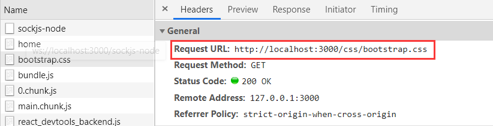

但是在写路由的时候，有的时候就会出现多级目录，

```react
<MyNavLink to = "/cyk/about" >About</MyNavLink>

<Route path="/cyk/about"component={About}/>
```

这个时候就在刷新页面，就会出现问题：

样式因为路径问题加载失败，此时页面返回public下面的Index.html

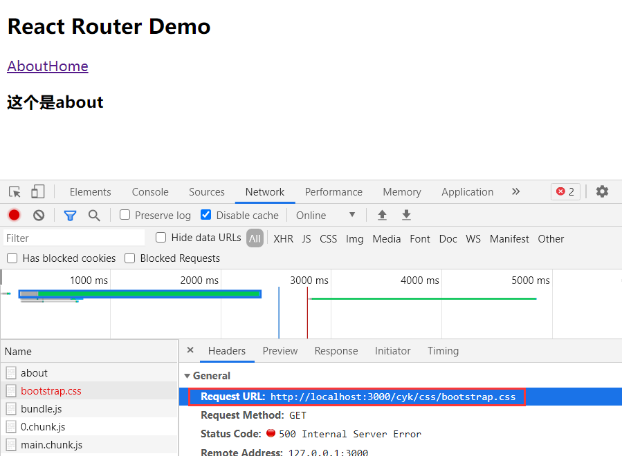

解决这个问题，有三个方法：

1.样式加载使用绝对位置

```react
 <link href="/css/bootstrap.css" rel="stylesheet"> 
```

2.使用 %PUBLIC_URL%

```
 <link href="%PUBLIC_URL%/css/bootstrap.css" rel="stylesheet">
```

3.使用HashRouter

因为HashRouter会添加#，默认不会处理#后面的路径，所以也是可以解决的


## 模糊匹配和精准匹配

react默认是开启模糊匹配的。

比如：

```react
<MyNavLink to = "/home/a/b" >Home</MyNavLink>
```

此时该标签匹配的路由，分为三个部分 home a b；将会根据这个**先后顺序匹配**路由。

如下就可以匹配到相应的路由：

```react
<Route path="/home"component={Home}/>
```

但是如果是下面这个就会失败，也就是说他是根据路径一级一级查询的，可以包含前面那一部分，但并不是只包含部分就可以。

```react
<Route path="/a" component={Home}/>
```

当然也可以使用这个精确的匹配 exact={true}

如以下：这样就精确的匹配/home，则上面的/home/a/b就不行了

```react
<Route exact={true}  path="/home" component={Home}/>
或者
<Route exact path="/home" component={Home}/>
```

​	

## 初始化路由

在配置好路由，最开始打开页面的时候，应该是不会匹配到任意一个组件。这个时候页面就显得极其不合适，此时应该默认的匹配到一个组件。

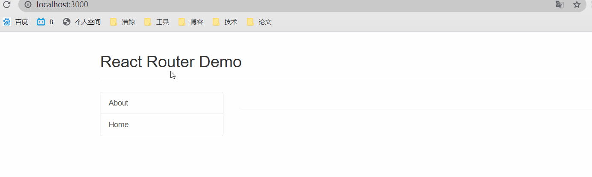

此时就需要使用Redirect进行**默认匹配**了。如下的代码就是默认匹配/home路径所到的组件

```react
<Switch>
    <Route path="/about"component={About}/>
    {/* exact={true}：开启严格匹配的模式，路径必须一致 */}
    <Route   path="/home" component={Home}/>
    {/* Redirect:如果上面的都没有匹配到，就匹配到这个路径下面 */}
    <Redirect  to = "/home"/>
</Switch>
```

就可以做到如下的效果：

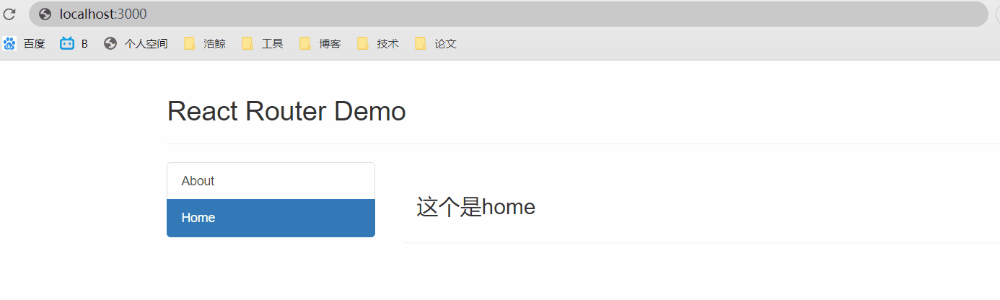

## 嵌套路由

简单来说就是在一个路由组件中又使用了一个路由，就形成了嵌套路由。

举个例子来说：

我们在home这个路由组件中又添加两个组件：

```react
APP.jsx:
<Route   path="/home" component={Home}/>
Home.jsx:
<div>
    <ul className="nav nav-tabs">
    <li>
    	<MyNavLink to = "/home/news">News</MyNavLink>
    </li>
    <li>
    	<MyNavLink  to = "/home/message">Message</MyNavLink>
    </li>
    </ul>
    
    <Switch>
        <Route path = "/home/news" component={News} />
        <Route path = "/home/message" component={Message} />
        <Redirect to="/home/message"/>
    </Switch>
</div>
```

 react中路由的注册是有顺序的，因此在匹配的时候也是按照这个顺序进行的，因此会先匹配父组件中的路由 

比如上面的 /home/news的路由处理过程：

​	1.因为父组件home的路由是先注册的，因此在匹配的时候先去找home的路由，也就是根据/home/news先模糊匹配到/home

​	2.在去Home组件里面去匹配相应的路由，从而找到了/home/news进行匹配，因此找到了News组件。

但是如果开启精确匹配，就会在第一步的时候卡住，这个时候就走不下去了。**因此不要轻易的使用精确匹配**


## 向路由组件传递参数

1.**params**参数

- 路由链接(携带参数)：<Link to='/demo/test/tom/18'}>详情</Link>

- 注册路由(声明接收)：<Route path="/demo/test/:name/:age" component={Test}/>

- 接收参数：this.props.match.params

2.**search**参数

- 路由链接(携带参数)：<Link to='/demo/test?name=tom&age=18'}>详情</Link>

- 注册路由(无需声明，正常注册即可)：<Route path="/demo/test" component={Test}/>

- 接收参数：**this.props.location.search**

- 备注：获取到的search是urlencoded编码字符串，需要借助querystring解析

3.**state**参数

- 路由链接(携带参数)：<Link to={{pathname:'/demo/test',state:{name:'tom',age:18}}}>详情</Link>

- 注册路由(无需声明，正常注册即可)：<Route path="/demo/test" component={Test}/>

- 接收参数：this.props.location.state

- 备注：刷新也可以保留住参数

- 优点：**url不暴露参数**


## 编程式路由导航

借助this.prosp.history对象上的API对操作路由跳转、前进、后退

- this.prosp.history.**push**()

- this.prosp.history.**replace**()

- this.prosp.history.goBack()

- this.prosp.history.goForward()

- this.prosp.history.go()


## WithRouter

- withRouter可以加工一般组件，让一般组件具备路由组件所特有的API

- **withRouter的返回值是一个新组件**

```react
import React, { Component } from 'react'
import {withRouter} from 'react-router-dom'

class Header extends Component {

	back = ()=>{
		this.props.history.goBack()
	}

	forward = ()=>{
		this.props.history.goForward()
	}

	go = ()=>{
		this.props.history.go(-2)
	}

	render() {
		console.log('Header组件收到的props是',this.props);
		return (
			<div className="page-header">
				<h2>React Router Demo</h2>
				<button onClick={this.back}>回退</button>&nbsp;
				<button onClick={this.forward}>前进</button>&nbsp;
				<button onClick={this.go}>go</button>
			</div>
		)
	}
}

export default withRouter(Header)
```


## BrowserRouter与HashRouter的区别

1.底层原理不一样：

- BrowserRouter使用的是H5的history API，不兼容IE9及以下版本。

- HashRouter使用的是URL的哈希值。

2.path表现形式不一样

- BrowserRouter的路径中没有#,例如：localhost:3000/demo/test

- HashRouter的路径包含#,例如：localhost:3000/#/demo/test

3.刷新后对路由state参数的影响

​    (1).BrowserRouter没有任何影响，因为state保存在history对象中。

​    (2).**HashRouter刷新后会导致路由state参数的丢失！！！**

4.备注：HashRouter可以用于解决一些路径错误相关的问题。


# 13. antd的按需引入+自定主题

   1.安装依赖：yarn add react-app-rewired customize-cra babel-plugin-import less less-loader

   2.修改package.json

​     ....

​      "scripts": {

​       "start": "react-app-rewired start",

​       "build": "react-app-rewired build",

​       "test": "react-app-rewired test",

​       "eject": "react-scripts eject"

​      },

​     ....

   3.根目录下创建config-overrides.js

    ```javascript
     //配置具体的修改规则
    const { override, fixBabelImports,addLessLoader} = require('customize-cra');
    
         module.exports = override(
    
          fixBabelImports('import', {
    
          	 libraryName: 'antd',
    
          	 libraryDirectory: 'es',
    
          	 style: true,
    
          }),
    
          addLessLoader({
    
           lessOptions:{
    
           	 javascriptEnabled: true,
    
           	 modifyVars: { '@primary-color': 'green' },
    
           }
    
          }),
    
         );
    ```


​    4.备注：不用在组件里亲自引入样式了，即：import 'antd/dist/antd.css'应该删掉


# 14. Redux

## redux理解

### 学习文档

1. 英文文档: https://redux.js.org/

2. 中文文档: http://www.redux.org.cn/

3. Github: https://github.com/reactjs/redux

### redux是什么

1. redux是一个专门用于做**状态管理**的JS库(不是react插件库)。

2. 它可以用在react, angular, vue等项目中, 但基本与react配合使用。

3. 作用: 集中式管理react应用中多个组件**共享**的状态。


### 什么情况下需要使用redux

1. 某个组件的状态，需要让其他组件可以随时拿到（**共享**）。

2. 一个组件需要改变另一个组件的状态（**通信**）。

3. 总体原则：能不用就不用, 如果不用时比较吃力才考虑使用。


### redux工作流程


## redux的三个核心概念

### action

1. 动作的对象

2. 包含2个属性

   type：标识属性, 值为字符串, 唯一, 必要属性

   data：数据属性, 值类型任意, 可选属性

3. 例子：{ type: 'ADD_STUDENT',data:{name: 'tom',age:18} }

### reducer

1. 用于**初始化**状态、**加工**状态。

2. 加工时，根据旧的state和action， 产生新的state的**纯函数**。

### store

1. 将state、action、reducer联系在一起的对象

2. 如何得到此对象?

   1)   import {createStore} from 'redux'

   2)   import reducer from './reducers'

   3)   const store = createStore(reducer)

3. 此对象的功能?

   1)   getState(): 得到state

   2)   dispatch(action): 分发action, 触发reducer调用, 产生新的state

   3)   subscribe(listener): 注册监听, 当产生了新的state时, 自动调用


## redux的核心API

### createstore()

作用：创建包含指定reducer的store对象

### store对象

1. 作用: redux库最核心的管理对象

2. 它内部维护着:

   1)   state

   2)   reducer

3. 核心方法:

   1)   getState()

   2)   dispatch(action)

   3)   subscribe(listener)

4. 具体编码:

   1)   store.getState()

   2)   store.dispatch({type:'INCREMENT', number})

   3)   store.subscribe(render)

### applyMiddleware()

作用：应用上基于redux的中间件(插件库)

### combineReducers()

作用：合并多个reducer函数


## 使用redux编写应用

  **效果**

#### 1.求和案例_redux精简版

  (1).去除Count组件自身的状态

  (2).src下建立:

- redux

- store.js

-count_reducer.js


  (3).store.js：

​     1).引入redux中的createStore函数，创建一个store

​     2).createStore调用时要传入一个为其服务的reducer

​     3).记得暴露store对象


  (4).count_reducer.js：

​     1).reducer的本质是一个函数，接收：preState,action，返回加工后的状态

​     2).reducer有两个作用：初始化状态，加工状态

​     3).reducer被第一次调用时，是store自动触发的，

​         传递的preState是undefined,

​         传递的action是:{type:'@@REDUX/INIT_a.2.b.4}


  (5).在index.js中监测store中状态的改变，一旦发生改变重新渲染<App/>

​    备注：redux只负责管理状态，至于状态的改变驱动着页面的展示，要靠我们自己写。


#### 2.求和案例_redux完整版

  新增文件：

   1.count_action.js 专门用于创建action对象

   2.constant.js 放置容易写错的type值


#### 3.求和案例_redux异步action版

> 异步action，就是指action的值为函数.
>
> 异步action中一般都会调用同步action，异步action不是必须要用的。

```javascript
//store.js引入redux-thunk，用于支持异步action
import thunk from 'redux-thunk'
```

  ```javascript
  export const createIncrementAsyncAction = (data,time) => {
  	return (dispatch)=>{
  		setTimeout(()=>{
  			dispatch(createIncrementAction(data))
  		},time)
  	}
  }
  ```

 (1).明确：延迟的动作不想交给组件自身，想交给action

   (2).何时需要异步action：想要对状态进行操作，但是具体的数据靠异步任务返回。

   (3).具体编码：

​     1).yarn add redux-thunk，并配置在store中

​     2).创建action的函数不再返回一般对象，而是一个**函数**，该函数中写异步任务。

​     3).异步任务有结果后，分发一个同步的action去真正操作数据。

   (4).备注：异步action不是必须要写的，完全可以自己等待异步任务的结果了再去分发同步action。


#### 4.求和案例_react-redux基本使用


   (1).明确两个概念：

​      1).**UI组件**:不能使用任何redux的api，只负责页面的呈现、交互等。

​      2).**容器组件**：负责和redux通信，将结果交给UI组件。

   (2).如何创建一个容器组件————靠react-redux 的 **connect**函数

- connect(mapStateToProps,mapDispatchToProps)(UI组件)

- mapStateToProps:映射状态，返回值是一个对象

- mapDispatchToProps:映射操作状态的方法，返回值是一个对象

   (3).备注1：容器组件中的store是靠**props**传进去的，而不是在容器组件中		直接引入

   (4).备注2：mapDispatchToProps，也可以是一个对象


#### 5.求和案例_react-redux优化

(1).容器组件和UI组件整合一个文件

(2).无需自己给容器组件传递store，给<App/>包裹一个<Provider store={store}>即可。

(3).使用了react-redux后也不用再自己检测redux中状态的改变了，容器组件可以自动完成这个工作。

(4).mapDispatchToProps也可以简单的写成一个对象

(5).一个组件要和redux“打交道”要经过哪几步？

​       (1).定义好UI组件---不暴露

​       (2).引入connect生成一个容器组件，并暴露，写法如下：

```js
connect(
	state => ({key:value}), //映射状态
	{key:xxxxxAction} //映射操作状态的方法
)(UI组件)
```

​       (4).在UI组件中通过this.props.xxxxxxx读取和操作状态


#### 6.求和案例_react-redux数据共享版

   (1).定义一个Pserson组件，和Count组件通过redux共享数据。

   (2).为Person组件编写：reducer、action，配置constant常量。

   (3).重点：Person的reducer和Count的Reducer要使用combineReducers进行合并，

​     合并后的总状态是一个对象！！！

   (4).交给store的是总reducer，最后注意在组件中取出状态的时候，记得“取到位”。


#### 7.求和案例_react-redux开发者工具的使用

   (1).yarn add redux-devtools-extension

   (2).store中进行配置

import {composeWithDevTools} from 'redux-devtools-extension'

const store=createStore(allReducer,composeWithDevTools(applyMiddleware(thunk)))


#### 8.求和案例_react-redux最终版

   (1).所有变量名字要规范，尽量触发对象的简写形式。

   (2).reducers文件夹中，编写index.js专门用于汇总并暴露所有的reducer


## redux异步编程

### 理解：

1. redux默认是不能进行异步处理的,

2. 某些时候应用中需要在**redux****中执行异步任务**(ajax, 定时器)

### 使用异步中间件

`npm install --save redux-thunk`


## react-redux

### 理解

1. 一个react插件库

2. 专门用来简化react应用中使用redux

### react-Redux将所有组件分成两大类

1. UI组件

   1)   只负责 UI 的呈现，不带有任何业务逻辑

   2)   通过props接收数据(一般数据和函数)

   3)   不使用任何 Redux 的 API

   4)   一般保存在components文件夹下

2. 容器组件

   1)   负责管理数据和业务逻辑，不负责UI的呈现

   2)   使用 Redux 的 API

   3)   一般保存在containers文件夹下

### 相关API

1. **Provider**：让所有组件都可以得到state数据

**<Provider store={store}> <App/></Provider>**   

2. **connect**：用于包装 UI 组件生成容器组件

```javascript
import { connect } from 'react-redux' 

connect( mapStateToprops, mapDispatchToProps)(Counter)        
```

3. **mapStateToprops**：将外部的数据（即state对象）转换为**UI组件的标签属性**

```js
/* 
	1.mapStateToProps函数返回的是一个对象；
	2.返回的对象中的key就作为传递给UI组件props的key,value就作为传递给UI组件props的value
	3.mapStateToProps用于传递状态
*/
const mapStateToprops = function (state) {    
	return {    value: state    }    
}     
```

4. **mapDispatchToProps**：将分发action的函数转换为UI组件的标签属性

```js
/* 
	1.mapDispatchToProps函数返回的是一个对象；
	2.返回的对象中的key就作为传递给UI组件props的key,value就作为传递给UI组件props的value
	3.mapDispatchToProps用于传递操作状态的方法
*/
function mapDispatchToProps(dispatch){
	return {
		jia:number => dispatch(createIncrementAction(number)),
		jian:number => dispatch(createDecrementAction(number)),
		jiaAsync:(number,time) => dispatch(createIncrementAsyncAction(number,time)),
	}
}
```


## 使用上redux调试工具

### 安装chrome浏览器插件

### 下载工具依赖包

```
npm install --save-dev redux-devtools-extension
```

```javascript
import {composeWithDevTools} from 'redux-devtools-extension'

const store=createStore(allReducer,composeWithDevTools(applyMiddleware(thunk)))
```


## 纯函数和高阶函数

### 纯函数

1. 一类特别的函数: **只要是同样的输入(实参)，必定得到同样的输出(返回)**

2. 必须遵守以下一些约束 

   1)   不得改写参数数据

   2)   不会产生任何副作用，例如网络请求，输入和输出设备

   3)   不能调用Date.now()或者Math.random()等不纯的方法 

3. **redux的reducer函数必须是一个纯函数**

### 高阶函数

1. 理解: 一类特别的函数

   1)   情况1: **参数是函数**

   2)   情况2: **返回是函数**

2. 常见的高阶函数: 

   1)   定时器设置函数

   2)   数组的forEach()/map()/filter()/reduce()/find()/bind()

   3)   promise

   4)   react-redux中的connect函数

3. 作用: 能实现更加动态, 更加可扩展的功能


# 15. React扩展

### 1. setState

##### setState更新状态的2种写法

```react
(1). setState(stateChange, [callback])------对象式的setState
    1.stateChange为状态改变对象(该对象可以体现出状态的更改)
    2.callback是可选的回调函数, 它在状态更新完毕、界面也更新后(render调用后)才被调用
					
(2). setState(updater, [callback])------函数式的setState
    1.updater为返回stateChange对象的函数。
    2.updater可以接收到state和props。
    4.callback是可选的回调函数, 它在状态更新、界面也更新后(render调用后)才被调用。
总结:
	1.对象式的setState是函数式的setState的简写方式(语法糖)
	2.使用原则：
		(1).如果新状态不依赖于原状态 ===> 使用对象方式
		(2).如果新状态依赖于原状态 ===> 使用函数方式
		(3).如果需要在setState()执行后获取最新的状态数据, 要在第二个callback函数中读取
```

------


### 2. lazyLoad

##### 路由组件的lazyLoad

```js
	//1.通过React的lazy函数配合import()函数动态加载路由组件 ===> 路由组件代码会被分开打包
	const Login = lazy(()=>import('@/pages/Login'))
	
	//2.通过<Suspense>指定在加载得到路由打包文件前显示一个自定义loading界面
	<Suspense fallback={<h1>loading.....</h1>}>
        <Switch>
            <Route path="/xxx" component={Xxxx}/>
            <Redirect to="/login"/>
        </Switch>
    </Suspense>
```


------


### 3. Hooks

##### 1. React Hook/Hooks是什么?

```react
(1). Hook是React 16.8.0版本增加的新特性/新语法
(2). 可以让你在函数组件中使用 state 以及其他的 React 特性
```

##### 2. 三个常用的Hook

```react
(1). State Hook: React.useState()
(2). Effect Hook: React.useEffect()
(3). Ref Hook: React.useRef()
```

##### State Hook

```react
(1). State Hook让函数组件也可以有state状态, 并进行状态数据的读写操作
(2). 语法: const [xxx, setXxx] = React.useState(initValue)  
(3). useState()说明:
        参数: 第一次初始化指定的值在内部作缓存
        返回值: 包含2个元素的数组, 第1个为内部当前状态值, 第2个为更新状态值的函数
(4). setXxx()2种写法:
        setXxx(newValue): 参数为非函数值, 直接指定新的状态值, 内部用其覆盖原来的状态值
        setXxx(value => newValue): 参数为函数, 接收原本的状态值, 返回新的状态值, 内部用其覆盖原来的状态值
```

##### Effect Hook

```react
(1). Effect Hook 可以让你在函数组件中执行副作用操作(用于模拟类组件中的生命周期钩子)
(2). React中的副作用操作:
        发ajax请求数据获取
        设置订阅 / 启动定时器
        手动更改真实DOM
(3). 语法和说明: 
        useEffect(() => { 
          // 在此可以执行任何带副作用操作
          return () => { // 在组件卸载前执行（相当于componentWillUnMount）
            // 在此做一些收尾工作, 比如清除定时器/取消订阅等
          }
        }, [stateValue]) // 如果指定的是[], 回调函数只会在第一次render()后执行
					   // 检测状态更新，不写则检测所有状态
    
(4). 可以把 useEffect Hook 看做如下三个函数的组合
        componentDidMount()
        componentDidUpdate()
    	componentWillUnmount() 
```

##### Ref Hook

```react
(1). Ref Hook 可以在函数组件中存储/查找组件内的标签或任意其它数据
(2). 语法: const refContainer = useRef()
(3). 作用: 保存标签对象,功能与React.createRef()一样
```

------


### 4. Fragment

##### 使用

```react
使用方式：
	1.<Fragment><Fragment>	// 只能用于key属性
	2.<></>  			   // 不允许传任何属性
```

##### 作用

> 可以不用必须有一个真实的DOM根标签了
>
> （例：最外层不用包一个div）

<hr/>


### 5. Context

##### 理解

> 一种组件间通信方式, 常用于【**祖组件**】与【**后代组件**】间通信

##### 使用

```js
1) 创建Context容器对象：	const XxxContext = React.createContext()  	
2) 渲染子组时，外面包裹xxxContext.Provider, 通过value属性给后代组件传递数据：	<xxxContext.Provider value={数据}>		子组件    </xxxContext.Provider>    
3) 后代组件读取数据：	
	//第一种方式:仅适用于类组件 	  
	static contextType = xxxContext  // 声明接收context	  
	this.context // 读取context中的value数据	  	

	//第二种方式: 函数组件与类组件都可以	  
	<xxxContext.Consumer>	    
        {value => ( 
         // value就是context中的value数据	        要显示的内容	      
         )}	  
    </xxxContext.Consumer>
```

##### 注意

```react
在应用开发中一般不用context, 一般都用它的封装react插件
```

<hr/>


### 6. 组件优化

##### Component的2个问题 

> 1. 只要执行setState(),即使不改变状态数据, 组件也会重新render() ==> 效率低
>
> 2. 只要当前组件重新render(), 就会自动重新render子组件，纵使子组件没有用到父组件的任何数据 ==> 效率低

##### 效率高的做法

>  只有当组件的state或props数据发生改变时才重新render()

##### 原因

>  Component中的shouldComponentUpdate()总是返回true

##### 解决

```react
办法1: 	
	重写shouldComponentUpdate()方法	
	比较新旧state或props数据, 如果有变化才返回true, 如果没有返回false
办法2:  	
	使用PureComponent	
    PureComponent重写了shouldComponentUpdate(), 只有state或props数据有变化才返回true	
	注意: 		
		只是进行state和props数据的浅比较, 如果只是数据对象内部数据变了, 返回false  		不要直接修改state数据, 而是要产生新数据项目中一般使用PureComponent来优化
```

<hr/>


### 7. render props

##### 如何向组件内部动态传入带内容的结构(标签)?

```js
Vue中: 	使用slot技术, 也就是通过组件标签体传入结构  <A><B/></A>
React中:	1.使用children props: 通过组件标签体传入结构	（this.props.children）
		2.使用render props: 通过组件标签属性传入结构,而且可以携带数据，一般用render函数属性
```

###### children props

```react
<A>  <B>xxxx</B></A>
{this.props.children}
问题: 如果B组件需要A组件内的数据, ==> 做不到 
```

###### render props

```react
<A render={(data) => <C data={data}></C>}></A>
A组件: {this.props.render(内部state数据)}
C组件: 读取A组件传入的数据显示 {this.props.data} 
```


<hr/>

### 8. 错误边界

##### 理解：

错误边界(Error boundary)：用来捕获后代组件错误，渲染出备用页面

##### 特点：

只能捕获**后代组件生命周期**产生的错误，不能捕获自己组件产生的错误和其他组件在合成事件、定时器中产生的错误

##### 使用方式：

getDerivedStateFromError配合componentDidCatch

```js
// 生命周期函数，一旦后台组件报错，就会触发
static getDerivedStateFromError(error) 
{    
    console.log(error);    // 在render之前触发    
    // 返回新的state    
    return {        
        hasError: true,    
    };
}
componentDidCatch(error, info) {    // 统计页面的错误。发送请求发送到后台去    console.log(error, info);}
```


### 9. 组件通信方式总结

##### 组件间的关系：

- 父子组件
- 兄弟组件（非嵌套组件）
- 祖孙组件（跨级组件）

##### 几种通信方式：

```react
1.props：		
	(1).children props		
	(2).render props	
2.消息订阅-发布：		
	pubs-sub、event等等	
3.集中式管理：		
	redux、dva等等	
4.conText:		
	生产者-消费者模式
```

##### 比较好的搭配方式：

```react
父子组件：props	
兄弟组件：消息订阅-发布、集中式管理	
祖孙组件(跨级组件)：消息订阅-发布、集中式管理、conText(开发用的少，封装插件用的多)
```


# 16. 项目打包

##### 1.打包

`npm run build`

##### 2.开启服务器

> 借用serve库

